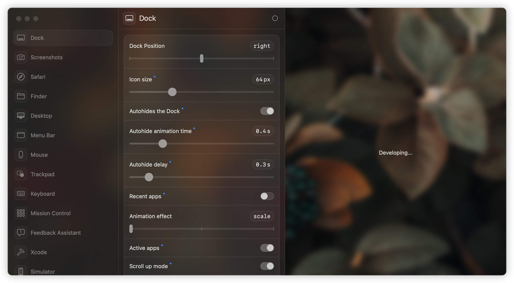

<div align="center">
    
    <h1>System Defaults Editor</h1>
</div>

<div align="center">
    
</div>


System_Defaults_Editor is a tool for visualize the value of system defaults. It is a macOS application that allows users to modify system defaults in a user-friendly way. The app provides a graphical interface for users to easily change system settings without needing to use the command line.

## Features/Roadmap

- [x] Read system defaults
- [x] write system defaults
- [x] Read and write plist files
- [ ] Export plist files
- [ ] Show details of system defaults

## Usage(Development)

1. **Git clone**

```bash
git clone https://github.com/Nekomi-Kokadaigaku/System_Defaults_Editor.git
```

2. **Enter the folder**

```bash
cd System_Defaults_Editor
```

## Others

- **Data Source**: [https://macos-defaults.com/](https://macos-defaults.com/)

- **UI Framework**: [Luminare](https://github.com/MrKai77/Luminare/tree/loop-1.2.0)
